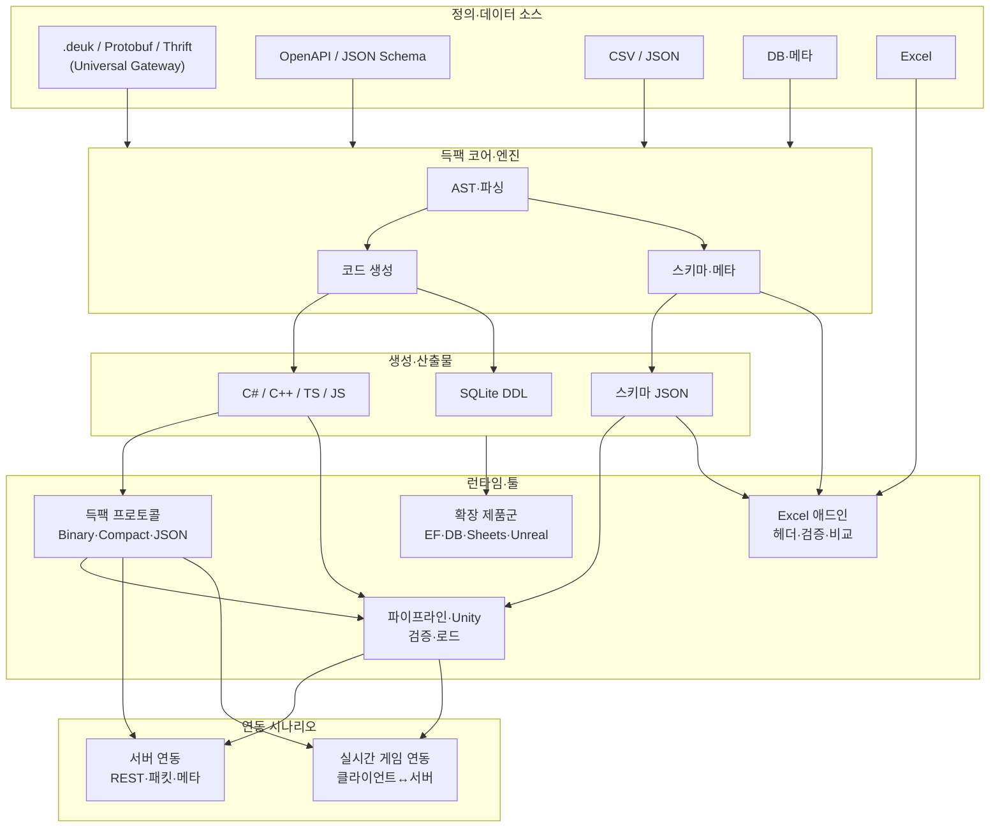
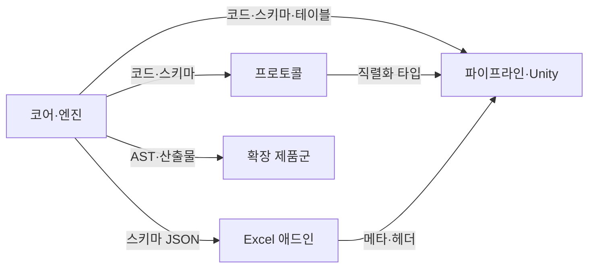

# 제품 관계도

{: style="display: block; margin: 0 auto 2rem auto; max-width: 500px;"}

득팩 제품군 간 **데이터·스키마 흐름**과 **관계**를 한눈에 볼 수 있는 관계망입니다.

---

## 전체 관계도

- **정의·데이터 소스**: 득팩 IDL(.deuk)·Protobuf·Thrift·OpenAPI·CSV·JSON·DB·스프레드시트 등이 **Universal IDL Gateway**인 코어 엔진으로 들어갑니다.
- **코어·엔진**: 파싱·AST를 바탕으로 **코드 생성**과 **스키마·메타**를 만듭니다.
- **생성·산출물**: C#/C++/TS/JS 코드, SQLite, 스키마 JSON이 나와 **프로토콜·파이프라인·Excel 애드인·확장 제품**에서 사용됩니다.
- **런타임·툴**: 프로토콜(직렬화·메시지), Excel 애드인(헤더·검증), 파이프라인·Unity(검증·로드), 확장 제품군이 코어 산출물을 공유합니다.
- **서버 연동**: 프로토콜·파이프라인이 생성한 타입·스키마로 REST·패킷·메타를 서버와 주고받을 수 있습니다.
- **실시간 게임 연동**: 동일 스키마·직렬화로 클라이언트-서버 실시간 패킷·메타·메시지를 일관되게 처리할 수 있습니다.

---

## 제품별 의존 관계

- **코어·엔진**이 모든 제품의 기반(코드·스키마·AST)을 제공합니다.
- **프로토콜**은 코어가 생성한 타입으로 직렬화·메시지 처리를 하고, **파이프라인·Unity**·**서버 연동**·**실시간 게임 연동**에서 사용됩니다.
- **Excel 애드인**은 코어 스키마로 헤더·검증을 하고, 메타는 **파이프라인·Unity**로 이어질 수 있습니다.
- **서버 연동·실시간 게임 연동**: 동일 IDL·스키마에서 나온 코드·프로토콜로 클라이언트-서버·실시간 패킷·메타를 일관되게 주고받을 수 있습니다.
- **확장 제품군**은 코어(및 선택적으로 프로토콜·Excel) 위에 EF·DB·Sheets·Unreal 등으로 확장합니다.

---

## 다음 단계

- [제품군 개요](products/index.ko.md) — 제품별 역할·포함 범위
- [포지셔닝](positioning.ko.md) — 타깃·포지션
