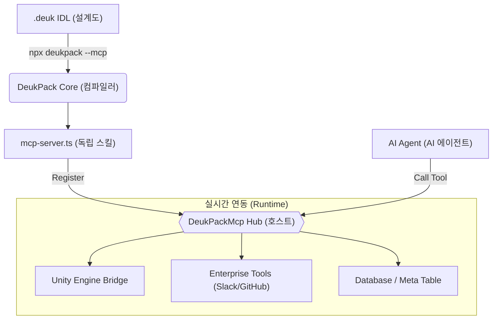

# DeukPackMcp: Universal AI Hub 🚧

!!! warning "Coming Soon"
    이 제품은 현재 **준비 중**인 차세대 기능입니다. 내부 클로즈 베타 테스트 중이며, 곧 공식 릴리스될 예정입니다.

## 개요

**DeukPackMcp**는 득팩의 모든 제품군과 외부 표준 명세(.proto, .deuk, OpenAPI 등)를 AI 에이전트가 즉시 실행할 수 있는 **'스킬(Skill)'**로 변환하여 집약하는 **범용 MCP(Model Context Protocol) 통합 허브**입니다.

DeukPack Core 엔진이 개별 IDL로부터 전용 MCP 서버 코드를 생성하는 **'컴파일러(Core)'** 역할을 한다면, **DeukPackMcp**는 생성된 수많은 스킬들을 하나로 묶고 유니티 엔진, 데이터베이스, 외부 API와 실시간으로 연결하는 **'호스트(Hub)'** 역할을 수행합니다.

### MCP 아키텍처 및 워크플로우

1.  **Step 1 (설계)**: `.deuk` IDL 파일 작성 (Blueprints)
2.  **Step 2 (생성)**: DeukPack Core를 통한 **Skill** 생성 (IDL-to-Skill)
3.  **Step 3 (실행)**: **DeukPackMcp** 허브에서 스킬 가동 및 실시간 연동 (Runtime Host)

---

## 핵심 가치

### 1. 전 제품군 스킬 통합 (Universal Bridging)
득팩의 각 제품군이 가진 고유 기능을 AI 도구로 정수화하여 하나의 게이트웨이에서 제공합니다.
- **Core · IDL**: 설계도 분석 및 AI 시맨틱 컨텍스트 기반 스킬 생성
- **Protocol**: 실시간 메시지 트레이싱 및 데이터 가드레일 허브
- **Excel Add-in**: AI가 직접 엑셀 시트 데이터를 검증하고 동기화하는 도구 제공
- **Navigation**: 에이전트가 맵 데이터를 직접 쿼리하고 경로 탐색할 수 있는 API
- **DeukUI**: 디자인 IR 분석을 통한 즉각적인 UI-to-Code 변환 브릿지

### 2. 멀티 프로토콜 허브 (Multi-Protocol Hub)
Core 엔진에서 생성된 개별 MCP 스킬들과 외부 표준 규격들을 단일 접속 포인트로 통합합니다.
- Protobuf (`.proto`) / Deuk IDL (`.deuk`) / Thrift (`.thrift`) / OpenAPI
- 위 모든 규격을 단일 MCP 허브를 통해 AI에게 일관된 인터페이스로 노출합니다.

### 3. 유니티 실시간 연동 (Unity Bridge)
유니티 엔진 내부 상태를 AI가 실시간으로 파악하고 제어할 수 있는 고성능 런타임 브릿지를 제공합니다.
- **Main-Thread Safe**: 유니티 메인 스레드 안전성을 보장하는 비동기 브리징 기술.
- **Runtime Control**: 게임 오브젝트 조작, 콘솔 로그 수집, 런타임 변수 수정을 AI가 직접 수행.

---

## 아키텍처 역할 분담

| 기능 | DeukPack Core (Generator) | DeukPackMcp (Hub) |
| :--- | :--- | :--- |
| **역할** | 설계도 기반 코드 생성 (Factory) | 런타임 통합 및 실행 (Gateway) |
| **주요 작업** | IDL → 개별 전용 MCP 서버 생성 | 여러 MCP 스킬 통합 관리 |
| **핵심 기술** | AST 분석 및 코드 생성 엔진 | 유니티 브릿지, 인증, 멀티 프로토콜 릴레이 |
| **사용 시점** | 개발 단계 (Build Time) | 실행 단계 (Runtime) |

---

## 로드맵 (Roadmap)
- [ ] **Unified Skill Gateway**: 생성된 개별 MCP 스킬들을 클릭 한 번으로 통합 허브에 등록
- [ ] **Enterprise Plugin Pack**: Slack, GitHub, Jira 연동 브리지 제공
- [ ] **AI Guardrail Registry**: 에이전트의 잘못된 입력을 스키마 레벨에서 원천 차단하는 가드레일 엔진

---

[제품군 개요로 돌아가기](index.ko.md)
